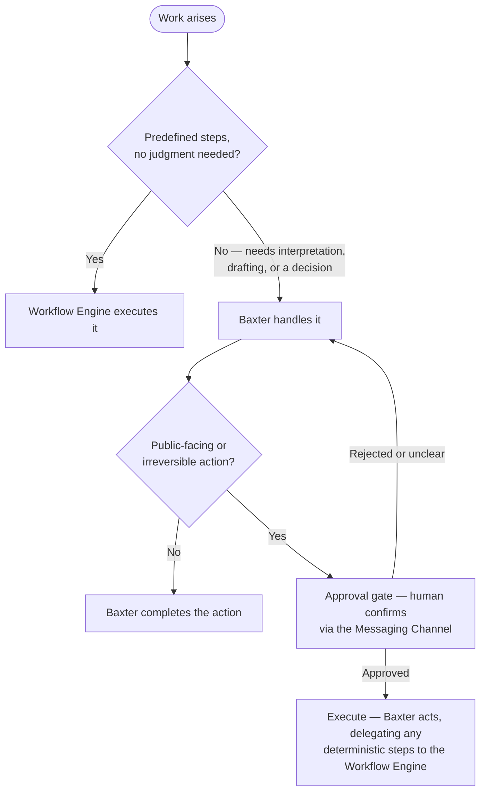
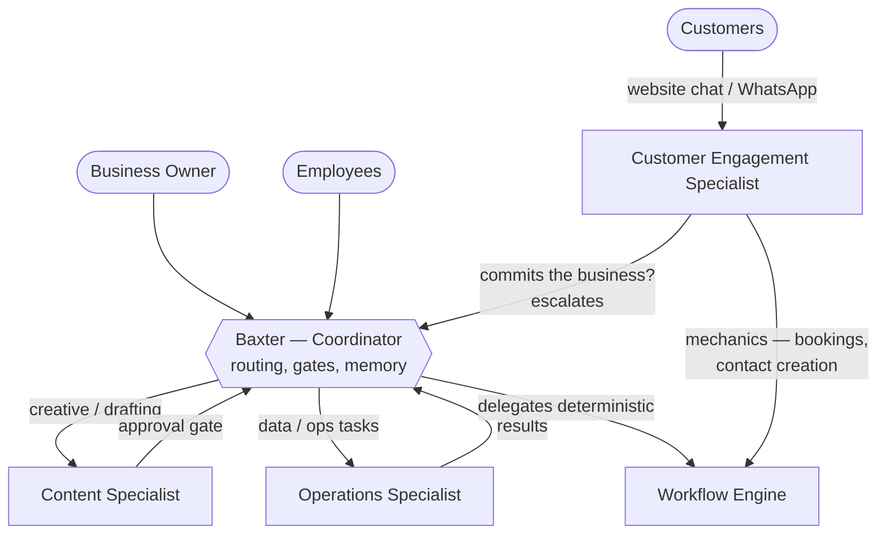
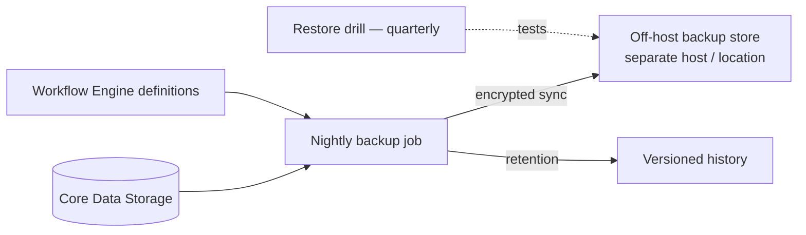
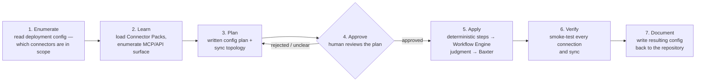
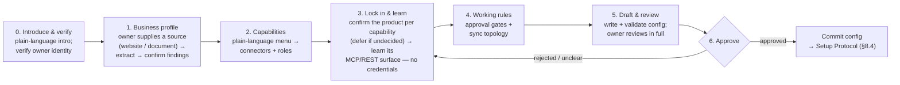

# Bradshaw Knox Business AI Assistant — Architecture Framework

*System: Bradshaw Knox Business AI Assistant | Agent: "Baxter" | Status: Foundational architecture*

**Objective.** A repeatable business system assembled from a **fixed, reusable core** plus **swappable connector modules**. The core is identical in every deployment; connectors adapt the system to each business.

> **Scope.** Generic architecture only. Vendor selection, hosting, pricing, and business-specific workflow definitions and configuration are handled separately.

---

## 1. The Core Concept

- The **core** provides everything that is the same in any business: an intelligence that coordinates (Baxter), an automation layer that executes, durable data storage the core owns, and gateways through which people and machines interact with the system.
- **Connector modules** supply business capabilities (Website, CRM, Email Marketing, Social, Accounting, …). They are optional, interchangeable, and interact with the system **only through the core**.
- Rule of thumb: **the core never changes per business — connectors are chosen per business.**

---

## 2. Core Components

| Core Component | Role | Constraint |
|---|---|---|
| **Baxter — AI Agent** | **Coordination:** interprets requests, makes decisions, orchestrates workflows and connectors | The only source of judgment in the system |
| **Workflow Engine** | **Automation:** executes predefined, deterministic workflows | No judgment, no content generation — ever |
| **Data Storage** | **Storage:** durable, core-owned store for the files, artifacts, and Baxter's long-term memory | One standard store; connectors and workflows access it through the core |
| **Backup / Recovery** | **Continuity:** scheduled off-host backups and tested restoration of everything the core owns | Nightly, off-host, versioned; restore drills required |
| **Secrets Service** | **Security:** the only client of the password vault; serves secrets to agents and workflows under per-role scope | Least privilege per role; in-memory cache only; every access logged |
| **Memory Service** | **Memory:** core-owned long-term memory; serves remember / recall / forget / summarise to all roles under per-role scope | Required by the core; store shape chosen per deployment (§7.5) |
| **Messaging Channel** (human gateway) | **Interaction:** the defined channel between the system and the business owner and employees — conversation, alerts, approval gates | e.g., Telegram, Buzz, or any equivalent messaging platform |
| **API / Event Gateway** (machine gateway) | **Interaction:** inbound events from connectors and external systems; outbound calls from the core | **MCP first** — Model Context Protocol where the vendor provides it; documented REST APIs otherwise |

**Layering rule:** deterministic work → the Workflow Engine; judgment and creativity → Baxter; approval gates → a human, reached through the Messaging Channel.

---

## 3. Architecture Diagram

The **Messaging Channel is highlighted** — the single, clearly defined human-facing gateway for the business owner and employees. The **Config Workspace** (agent-local git, §7.2) holds every per-deployment setting (§7.2, §8.1); the skill bundles the fixed instruction set (§8.1).

```text
Business Owner ──┐
                 ├──────────►  [ Messaging Channel — human gateway ]
Employees ───────┘             conversation · alerts · approval gates
                                  │
                                  │  conversation / requests / approvals
                                  ▼
                     [ Baxter — AI Agent ] — judgment · orchestration
                                  │
                 ┌────────────────┼──────────────────────────────┐
                 │                │                              │
         reads / │ writes         │  delegates predefined tasks  │  instruction set +
                 │                │  events and results back     │  deployment config
                 ▼                ▼                              ▼
      [ Data Storage ]    [ Workflow Engine ]          [ Config Workspace ]
      files · artifacts   deterministic automation     versioned (git) —
                                                        per-business deployment
                                                        config (§7.2)
              │                │
              │                │  events in / calls out
              ▼                ▼
      [ Memory Service ]  [ API / Event Gateway ]
      long-term memory ·  machine gateway — MCP first,
      per-role namespaces REST otherwise
              │                │
              │ nightly backup │  events in / calls out
              ▼                ▼
      [ Backup / Recovery ][ Secrets Service ]          [ Connectors ]
      off-host · versioned  vault client —              chosen per business
                            per-role scoped             Website · CRM · Email ·
                                                        Social · Accounting
```

**How to read it:**

- Humans interact **only** through the Messaging Channel; connectors and external systems interact **only** through the API / Event Gateway. Nothing bypasses the core.
- All connector traffic flows through the gateway — events in, calls out. Deterministic handling goes to the Workflow Engine; judgment goes to Baxter.
- Machine connections use **MCP** wherever the vendor exposes an MCP server, and documented REST APIs otherwise — the choice is made once per connector, never per deployment.
- Baxter's instruction set comes bundled in the skill (§8.1); every per-business setting lives in the Config Workspace (versioned, git, §7.2) and is applied to the deployment, never typed into it (§7.2, §8).
- Secrets, memory, and configuration are core services: the Secrets Service guards vault access (§7.4), the Memory Service owns long-term memory (§7.5), the skill feeds the instruction set (§8.1), and the Config Workspace holds every per-business setting (§7.2).
- Connectors never talk to each other directly and never hide data — customer records live in the CRM connector; working files and artifacts live in core Data Storage.

---

## 4. Division of Labour

| Work Type | Owner | Examples |
|---|---|---|
| Deterministic, predefined | **Workflow Engine** | Inbound event → create CRM record; scheduled syncs; triggered routing and transformation |
| Judgment / creativity | **Baxter** | Interpreting a staff request, matching an ambiguous record, drafting customer-facing content, recommending next steps |
| Approval | **Human** (via Messaging Channel) | Sign-off before any public-facing, customer-visible, or irreversible action |



**Escalation chain:** Workflow Engine → Baxter → Human.

### 4.1 Baxter — Internal Roles

The default is **one agent with scoped tools, not many**. Specialist agents exist only where a single shared context becomes unsafe — three drivers justify a split:

1. **Credential / trust scope** — an agent that can publish or touch money must not hold routine credentials; least privilege per agent shrinks the blast radius of a mistake.
2. **Context isolation** — creative work (brand voice, drafting) and operational work (customers, invoices) pollute each other's memory; separate scopes stop one context from contaminating another.
3. **Concurrency** — a long creative job must not block an urgent operational request.

| Role | Scope (tools / memory / credentials) | Activated when | Never does |
|---|---|---|---|
| **Baxter — Coordinator** | Routing, approval gates, memory governance, system setup (§8) | Always | — |
| **Content Specialist** | Drafting and brand voice; content / social connector tools; creative memory scope | Deployment includes content or social connectors | Publishes or sends anything without the Coordinator's human approval gate |
| **Operations Specialist** | Customer, job, and finance data tasks; CRM / accounting connector tools; operational memory scope | Deployment includes CRM or accounting connectors | Touches publishing tools or takes any public-facing action |
| **Customer Engagement Specialist** | Customer chat on public channels (website widget, WhatsApp); FAQ and lookup tools; create CRM contacts; customer-facing memory scope | Deployment includes a customer chat channel | Commits the business — no promises, quotes, cancellations, or refunds; no access to finance or staff-facing tools |



**Rules:**

1. **Business people talk only to the Coordinator.** Staff-facing specialists are internal — no messaging endpoints of their own; the Coordinator routes and gates everything. **Customers are the one exception:** they interact only with the Customer Engagement Specialist, never with the Coordinator.
2. **Roster fixed by the core, activation per deployment.** The core defines the roles; a deployment activates only what its connector set needs — the same rule as connectors (§5).
3. **Scopes are locked.** Each specialist holds only its own tools, memory, and credentials — no cross-scope access, ever.
4. **No specialist publishes or spends — and the Customer Engagement Specialist never commits the business.** Anything public-facing, irreversible, or with business consequence passes the Coordinator's human approval gate — the same rule as connector actions (§5).
5. **Memory stays separate.** Each role keeps its own memory scope (§7.3); the Coordinator persists summaries of specialist work, so results survive without context pollution. Customer conversations are summarised into CRM leads (via the Workflow Engine); raw chat content is not retained — quotes, invoices, and records live in the connectors.
6. **Design the seams now, activate later.** Default deployments run Baxter alone; split when symptoms appear — memory bloat, wrong-tool invocations, or creative context contaminating an operational decision. A split is a configuration change (§7.2), not a rebuild.
7. **Roles, not profiles.** Profiles and bots (Hermes or otherwise) are implementation details; the framework defines roles and scopes, and cheap implementation never skips the justification test.

**Escalation:** staff requests — Coordinator → human; customer requests — Customer Engagement Specialist → Coordinator → human via the Messaging Channel.

**Deliberately not added:** a Finance agent (finance work is mostly deterministic — the Workflow Engine owns it), a Tech/Admin agent (setup is Baxter's job, §8), or per-connector agents (tool count is not a reason to split).

---

## 5. Connectors

Connectors are business capabilities layered onto the core. Illustrative set:

| Connector | Purpose | Typical path into the core |
|---|---|---|
| **Website** | Public presence, lead capture | Emits events into the API / Event Gateway → Workflow Engine |
| **CRM** | Customer relationship management — the single source of truth for customer records | Workflow Engine (deterministic) + Baxter (judgment) |
| **Email Marketing** | Campaigns and transactional sends | Workflow Engine (scheduled/sync) + Baxter (drafted sends) |
| **Social Scheduler** | Publishing social posts | Baxter drafts → approval gate → Workflow Engine publishes |
| **Accounting** | Invoicing, payments, reconciliation | Workflow Engine (deterministic syncs) |

**Connector rules:**

1. Optional and swappable — added only when a deployment needs them, replaceable without touching the core.
2. Interact with the system only via the core (gateways, Workflow Engine, Baxter, Data Storage) — never directly with each other.
3. Exactly one connector per deployment is the system of record for customer data (the CRM). Connectors may not keep parallel copies.
4. Any connector action that is public-facing or irreversible passes the human approval gate via the Messaging Channel.
5. Connect via **MCP** wherever the vendor provides an MCP server; otherwise use the documented REST API. The connection standard is chosen once per connector, never per deployment.

---

## 6. Deployment Model

A new business deployment is assembly, not engineering:

1. **Install** — deploy the agent harness (Baxter, Workflow Engine, Data Storage, Gateways are what the core provides), install the Baxter skill unchanged (§8.1), and open one Messaging Channel.
2. **Onboard** — Baxter runs the Onboarding Protocol (§8.6) with the business owner: a structured questionnaire that produces the Deployment Config in the config workspace (§7.2).
3. Select and connect the connectors that business needs.
4. Configure the predefined workflows in the Workflow Engine, Baxter's persona and business context, and the Messaging Channel endpoints.
5. Define the approval gates appropriate to that business.
6. Run the setup protocol — Baxter learns the chosen connectors and drives their configuration and syncs through the human approval gates (§8).

> **Operational defaults:** all per-business configuration is tracked as code in the agent-local config workspace, backed up per the owner's choice (§7.2), backup/recovery is enabled from day one (§7.1), and setup is agent-driven (§8).

---

## 7. Core Operations — Backup, Configuration, Memory, Secrets

The core is a business system, not a script — it ships with four operational capabilities: **backup and restoration**, **configuration tracking**, **memory management** for Baxter, and **secrets management**. All four are core-owned: identical in structure in every deployment, configured per business.

### 7.1 Backup and Restoration

**Principle: the core backs up what it owns.** Connector and SaaS data (CRM, accounting, email marketing, …) is handled by its vendor; the core is responsible for restoring everything it created.

| Item | Source | Restores |
|---|---|---|
| File store | Object store bucket (S3-compatible) — files and media | Every artifact the system works with |
| Baxter's long-term memory | Core Data Storage | Agent knowledge, facts, history |
| Workflow definitions | Workflow Engine | Automated flows, triggers, routing |
| Configuration | Versioned repository (§7.2) | Persona, business context, approval gates, endpoints |



**Rules:**

1. **Off-host and nightly.** Backups leave the deployment machine — a backup on the same disk dies with the host.
2. **Versioned retention.** Restore any point in time, not just "latest".
3. **Restore drills are mandatory.** An untested backup is a guess. Drill: wipe the stack, re-apply configuration from the repository, restore data, verify workflows and memory are intact.
4. **Restoration is deterministic:** configuration comes back from the repository, data comes back from the backup store.

### 7.2 Configuration Tracking — Configuration as Code

Every per-business difference — Baxter's persona and business context, workflow definitions, approval-gate rules, Messaging Channel endpoints — lives in a **versioned repository** (git) and is *applied* to the deployment rather than *typed into* it.

**Rules:**

1. **The repository is the source of truth for configuration.** No edits directly on the running system; changes flow repository → deploy. The repository is the **config workspace** — an agent-local git repository created by Baxter at bootstrap (§8.2); it is a real git repository even when it never leaves the agent.
2. **Every change is versioned and reversible.** "What changed before the approval gate broke?" is answered by the git history.
3. **Deployments are reproducible.** A new deployment (§6) is: install the skill → Baxter creates the workspace → onboard → apply. Assembly, not engineering.
4. **Backup and restore are one system.** Config comes back from the repository; data comes back from the backup store. The workspace is backed up to a **private git remote when the owner provides one**; if the owner declines, the config stays local-only and Baxter warns explicitly that agent-level backup must cover it — a business-critical system is expected to have its agent's configuration backed up (§8.2). Business configuration is never pushed to a public repository.
5. **Versioned and pinned.** The core is released under semantic version tags; every deployment pins the core version (the installed skill version) and each Connector Pack version (§8.2). What is running, and in which version, is exactly knowable for every deployment — updates are explicit, never silent, and flow only through a deliberate skill update.

### 7.3 Baxter — Memory Management

Baxter remembers in three tiers, all core-owned:

| Tier | What it holds | Lifecycle |
|---|---|---|
| **Working memory** | The active conversation — context for the current task | Volatile; dies with the session |
| **Long-term memory** | Persistent facts and preferences — e.g. "owner approves posts by 9am", client contact preferences, past decisions | Stored in core Data Storage; summarised, pruned, and retired on a schedule; backed up nightly |
| **Artifacts** | Files and media (photos, documents) | Stored in the file store; referenced, never duplicated |

**Rules:**

1. **Memory is core-owned.** It lives in core Data Storage and is restored with it — memory survives restarts, redeploys, and disasters.
2. **No parallel copies.** Customer records stay in the CRM connector — Baxter's memory never duplicates them. Memory holds core knowledge and agent-level facts only.
3. **Retrieve, don't stuff.** Memory is fetched on demand (search / retrieval) when a task needs it, not loaded wholesale into context.
4. **Keep it lean.** Summarise finished work, prune stale facts, retire what is no longer true — memory quality beats memory size.

> **The mechanism — where and how long-term memory is stored — is a deployment decision, specified in the Deployment Config (§7.5, §8.2).**

### 7.4 Secrets Management

Secrets — AI provider API keys, service passwords, credentials — are a **core-owned concern**. Humans manage them in a password vault (e.g., Bitwarden); agents and workflows never talk to the vault directly. They request secrets through a thin, core-owned **Secrets Service**, which is the only component that holds vault access.

```text
[ Baxter / specialists / Workflow Engine ]
              │  MCP / REST — "secret X, scope Y"
              ▼
        [ SECRETS SERVICE — core-owned ]
        · per-role scoping · in-memory cache only
        · audit log of every access
              │
              ▼
        [ Password vault — e.g., Bitwarden ]
        humans manage secrets here, in the UI
```

**Rules:**

1. **The Secrets Service is the only vault client.** Agents and workflows ask it; it authenticates, fetches, caches in memory only (never written to disk), logs every access, and re-handles expired vault sessions itself.
2. **Least privilege is enforced, not hoped for.** The service grants secrets per role (§4.1): the Coordinator may access all scopes; each specialist only its own. A specialist that must not touch finance credentials literally cannot — the service refuses. Never trust a model to self-scope.
3. **Secrets never enter the config repository (§7.2).** The repository holds references and scopes; the vault holds values. No `.env` files, no encrypted-at-rest config files — the vault is the only store.
4. **One root secret, well guarded.** Something must unlock the vault — a single bootstrap secret kept on the host only (file with restricted permissions, Docker secret, OS keyring, or TPM), never in git, with an offline copy (paper / offline media) for disaster recovery.
5. **The vault joins the backup scope (§7.1).** Nightly encrypted export to the off-host backup store, so a restore brings secrets back with it; the offline root secret covers total loss.
6. **Component-local stores stay minimal.** n8n keeps its own credential store for its own workflows; the vault is the canonical store for everything agent-accessible. No parallel copies.
7. **Per-role provider keys.** AI provider keys can be issued per role (content uses one provider/key, operations another) — isolation without extra infrastructure.
8. **Swap-friendly.** The Secrets Service is the only integration point: a different vault backend (e.g., Infisical, Vault) replaces Bitwarden without touching any agent.

### 7.5 The Memory Service — Store and Mechanism

The core **requires** long-term memory — Baxter cannot operate without it (§7.3). But *where it is stored and how* is a **deployment decision**, made in the Deployment Config (§8.2) at setup time, not baked into the core.

**Principle: the harness is stateless; memory is a core-owned service.**

- All long-term memory flows through a core-owned **Memory Service** — remember / recall / forget / summarise, exposed via MCP and REST.
- The agent harness is a stateless brain pointing at the service. Harness-built-in memory counts as volatile working memory only, never as the store of record — this keeps memory portable when the harness is swapped (§4.1 "roles, not profiles").
- Connector Packs are *static* knowledge (bundled in the skill, §8.1); the Memory Service holds *dynamic* knowledge only. The two never overlap.

```text
[Baxter / specialists — any harness]
              │  MCP / REST — remember · recall · forget · summarise
              ▼
        [ MEMORY SERVICE — core-owned ]
        · role-scoped namespaces (§4.1)   · audit log
        · lifecycle jobs — summarise / prune / retire
              │
              ▼
        [ Memory store — shape chosen per deployment ]
        sqlite (default) | postgres + pgvector
              │
              ▼
        nightly backup with core (§7.1)
```

**The deployment decision** (set in `deployment.yaml`, §8.2):

| Decision | Options | Default / guidance |
|---|---|---|
| Provider | `memory-service` (core-owned) · `harness-native` | `memory-service` — the only portable choice |
| Store | `sqlite` (single file, zero ops) · `postgres-pgvector` (standard, semantic-ready) | `sqlite` for small deployments |
| Location | store path / connection | inside core Data Storage so §7.1 covers it |
| Namespaces | per role on/off (§4.1) | all activated roles enabled |
| Retention | summarise / prune schedule | e.g., summarise at 14 days, prune at 90 days |
| Embeddings | `off` · `local` · `api` | `off` — a later upgrade behind the same recall API |

**Rules:**

1. **Memory is mandatory; the shape is configurable.** The core always requires long-term memory; only the store shape, location, and lifecycle are deployment choices.
2. **Harness-native memory is opt-in and lossy.** A deployment may pick `harness-native` only by accepting that memory is not portable, not role-scoped, and not in the deterministic backup path.
3. **Role scoping is enforced by the service, not the harness** (§4.1).
4. **Lifecycle is scheduled, not ad-hoc:** a deterministic trigger in the Workflow Engine fires; summarisation (judgment) goes to the owning specialist; pruning and retirement (deterministic) run in the Workflow Engine.
5. **Memory joins backup and restore drills** (§7.1).

---

## 8. System Setup & Self-Configuration

A deployment starts unconfigured. **Baxter bootstraps it**: loaded from the skill, it reads the instruction set, creates the config workspace, learns the chosen connectors, and drives their configuration — with the human at the approval gates. The instruction set is a core artifact; the setup protocol is core behaviour.

### 8.1 The Instruction Set — Layered

Baxter's instructions are not one prompt; they are three layers, all versioned as code (§7.2):

| Layer | Contents | Where it lives |
|---|---|---|
| **Core Constitution** (immutable) | Who Baxter is — a coordinator, not an executor; the layering rule (deterministic → Workflow Engine, judgment → Baxter, irreversible → human gate); memory rules (§7.3); the no-parallel-copy rule; the connector contract (MCP-first machine connections); and the setup protocol itself | Bundled in the Baxter skill — identical in every deployment, updated only via explicit skill updates (§7.2 rule 5) |
| **Deployment Config** | Persona details, business context, the chosen connector list, approval-gate rules, Messaging Channel endpoints | Per-deployment, in the agent-local config workspace (§7.2) |
| **Connector Packs** | One per connector: capabilities, MCP/API surface, configuration checklist, and the expected sync topology between connectors | Bundled in the Baxter skill, per connector |

**Packaging — the skill.** The core (Constitution, protocols, questionnaire, schema, Connector Packs) is distributed as an installable **skill** (`JexxaJ/baxter`), so any skills-compatible agent harness becomes Baxter with one install. The skill is the *only* copy of the core — no parallel distribution exists. The harness-installed skill files are read-only from Baxter's perspective; per-business configuration never lives inside the skill.

- The **Constitution** dictates *how Baxter behaves*; the **Connector Packs** tell it *what it is configuring*.
- Any deployment difference belongs in the Deployment Config — never in the Constitution. The instruction set follows the core/connector split: it never changes per business, the config does.

### 8.2 The Deployment Config — Shape and Schema

The Deployment Config lives in the **config workspace** — an agent-local git repository created by Baxter at bootstrap, one directory per business (§7.2):

```text
baxter-workspace/                # agent-local git repository — the config workspace
└── deployments/
    └── <business>/
        ├── deployment.yaml      # ← the Deployment Config — what Enumerate reads
        ├── business-context.md  # persona, facts, tone of voice — loaded into long-term memory
        ├── connector-proficiency/
        │   └── <connector>.md   # what Baxter learned about each locked product
        └── onboarding-draft.md  # during onboarding only — deleted at handoff
```

The core and Connector Packs are **not** in the workspace — they are bundled in the skill (§8.1). The workspace holds only per-business configuration. Its backup is an onboarding decision: a private git remote if the owner provides one; otherwise local-only, with the owner explicitly warned that agent-level backup must cover it (§7.1).

`deployment.yaml` declares *what is in scope* — nothing is inferred:

```yaml
deployment:
  name: example-business
  core_version: 1.0.0                      # pinned core release (§7.2 rule 5)
  business_context: business-context.md   # loaded into long-term memory (§7.3)

memory:                                   # required by the core — shape is a deployment decision (§7.5)
  provider: memory-service                # memory-service | harness-native
  store: sqlite                           # sqlite | postgres-pgvector
  location: /data/memory/baxter.sqlite    # inside core Data Storage
  namespaces:                             # per role (§4.1)
    coordinator: enabled
    content: enabled
    operations: enabled
    customer_engagement: disabled
  retention:
    summarise_after_days: 14
    prune_after_days: 90
  embeddings: off                         # off | local | api — upgrade behind the same recall API

connectors:
  - name: crm
    system_of_record: true                # exactly one, per §5 rule 3
    connection: mcp                       # mcp | rest — chosen once, per §5 rule 5
    connector_pack: connectors/crm.md
    pack_version: 1.0.0                   # pinned pack version (§7.2 rule 5)
    secrets: vault/connectors/crm         # vault path, NEVER values (§7.4)
  - name: email-marketing
    connection: mcp
    connector_pack: connectors/email-marketing.md
    pack_version: 1.0.0
    secrets: vault/connectors/email
  - name: accounting
    connection: rest
    connector_pack: connectors/accounting.md
    pack_version: 1.0.0
    secrets: vault/connectors/accounting

roles:                                    # §4.1 roster — activation per deployment
  coordinator: { active: true }
  content:          { active: true,  scopes: [email-marketing] }
  operations:       { active: true,  scopes: [crm, accounting] }
  customer_engagement: { active: false }  # no customer chat channel deployed yet

channels:
  messaging: telegram/baxter-example      # human gateway endpoint
  approvers:                              # verified identities on this channel (§8.2)
    owner: t.me/baxter-owner-handle
    staff: [t.me/staff1-handle, t.me/staff2-handle]
  customer_chat: []                       # website widget / whatsapp — empty = not activated

sync_topology:                            # declared, never guessed (§8.5 rule 4)
  - from: crm
    to: email-marketing
    what: new_contact_syncs_to_tagged_list
  - from: accounting
    to: crm
    what: invoice_status_updates_job

approval_gates:                           # each gate maps to a named approver from `channels.approvers`
  default: owner                          # owner only — never staff
```

**Human identity:** gateways are configured with the **verified identities** of the people who may use them — the `approvers` map in `channels` names who is who on that channel. An approval is accepted only from the mapped identity, and every gate records **who approved**. A gate is only as strong as the proof of who pressed it, so this mapping is part of the Deployment Config, never improvised at runtime.

**How Enumerate uses it:** the connector list drives step 2 (which Connector Packs to load, which MCP servers to enumerate); `roles.active` decides which specialists get created and with which scopes; `sync_topology` becomes the checklist for step 6 verification; `secrets` paths are validated against the vault early so a missing credential fails at step 2, not mid-setup; `approvers` and `approval_gates` are cross-checked so no gate references an unenrolled human.

**Schema.** The structure of `deployment.yaml` is formal, defined by **`references/deployment.schema.json`**. A config that fails schema structure or the semantic rules listed in the schema (`x-semantics` S1–S10) is malformed and halts setup — the config is the contract, and a malformed contract halts rather than improvises.

**Failure behaviour:** a missing connector entry, an undeclared sync, or a second `system_of_record: true` stops the protocol — Baxter asks, it never guesses. The config is the contract; a malformed contract halts setup.

### 8.3 How Baxter Learns the Connectors

Baxter does not memorise products; it retrieves and discovers:

1. **Connector Packs** — structured, versioned documents retrieved on demand (per the §7.3 "retrieve, don't stuff" rule): what the product does, how it is configured, its MCP/API surface, and the declared sync topology.
2. **Live self-description** — at runtime, each connector's MCP server exposes its own tools and resources, which Baxter enumerates; where a vendor has no MCP server, the REST API surface is documented in the Connector Pack instead. Either way, the connector pack stays thin and the live system is the source of truth.
3. **Documentation** — vendor docs referenced from the connector pack when deeper detail is needed.

A Connector Pack is not model training; it is lookup material — auditable, updateable, and swappable when a connector is replaced.

### 8.4 The Setup Protocol

Mandated by the Constitution, so every deployment boots identically:



1. **Enumerate** — read the Deployment Config: which connectors are in scope.
2. **Learn** — pull each Connector Pack; enumerate each connector's MCP/API surface.
3. **Plan** — produce a written configuration plan: what will be configured, and the sync topology between connectors (e.g., CRM → email contact sync, CRM → accounting invoicing).
4. **Approve** — a human reviews the plan. Configuring a live CRM or accounting system is irreversible, so the plan gates.
5. **Apply** — execute the plan; deterministic steps delegated to the Workflow Engine, judgment calls by Baxter.
6. **Verify** — smoke-test every connection: pull a test record, push a test record, confirm each declared sync actually fires.
7. **Document** — write the resulting configuration back to the repository. Setup state becomes versioned, auditable, and re-appliable.

> The full agent-facing procedure — inputs, credential provisioning, per-step outputs, and failure behaviour — lives in `references/setup-protocol.md` (identical in every deployment, §8.1). Setup consumes the Deployment Config and Connector Proficiency profiles produced by onboarding (§8.6); per-connector work is driven by each pack's Configuration Checklist (Apply) and Verification section (smoke tests).

### 8.5 Guardrails — Ensuring Baxter Behaves This Way

1. **The protocol is mandatory.** The Constitution requires plan → approve → verify; Baxter cannot skip a gate or declare a job done without a successful verification.
2. **Configuration is code.** Every setup action lands in the repository — a full audit trail of what was configured, when, and why.
3. **Credentials stay locked.** Connector credentials live only in the vault, fetched via the Secrets Service (§7.4); Baxter references them, never stores or logs them.
4. **Sync topology is declared, not guessed.** Baxter configures the syncs the plan declares; it never improvises new integrations between connectors.
5. **A deployment is re-runnable.** Because step 7 documents everything, a rebuild (§7.1) or a second deployment is: apply from the repository, then verify.
6. **The kill switch is real.** An owner- or operator-issued halt stops all agent processing — no new work, no memory writes, no connector actions — while leaving deterministic Workflow Engine jobs running. Only humans issue or release it; an agent never can. Issuing and release are logged (Constitution article 11).

### 8.6 The Onboarding Protocol

Before the Setup Protocol can run, *someone must know what the business needs*. That knowledge is gathered by **onboarding** — Baxter runs a structured questionnaire with the business owner over the Messaging Channel and produces the Deployment Config (§8.2). Onboarding answers *what the business needs*; setup (§8.4) performs *how it is configured*.



**Bootstrap assumption:** Baxter arrives via an installed skill (§8.1) on an agent harness with one Messaging Channel endpoint live (a simple Telegram bot or even a CLI session suffices) and a writable working directory — Baxter creates the config workspace itself (§8.2). The vault must be reachable for path validation during setup; credentials are added by humans, never collected by Baxter. Everything else is produced by onboarding, not assumed by it.

**Sources of questions — never improvised:**

1. **The core questionnaire** (`references/business-questionnaire.md`) — source request + business profile (with confirmation of extracted findings), capability menu, working rules. Identical in every deployment.
2. **Connector Pack "Onboarding Questions"** — asked per selected connector; skip-logic means only selected connectors' questions are asked. Once a connector is locked, the pack's **Proficiency** section defines what Baxter must learn; the product's own MCP self-description (§8.3) is the live source of truth.
3. **The schema** (`references/deployment.schema.json`) — every answer must land in a schema field; a question with no destination is out of scope.

**Rules:**

1. **Declaration, not discovery — confirmed extraction.** Nothing enters the config that the owner did not confirm. For the business profile Baxter prefers *sources over questions*: it asks for the business's website or a descriptive document, extracts what it can, and presents its findings for confirmation — scraped facts are proposals until the owner approves them. "Don't know yet" is a valid answer, recorded as an open item — never a guess.
2. **Plain language.** The owner never sees technical vocabulary; connection standards and store shapes come from Connector Packs and defaults (§5 rule 5), not from the owner.
3. **Secrets stay out of the conversation.** Baxter asks *where* credentials live (vault path) and instructs the owner in storing them; credential values typed into chat are refused and treated as compromised (§7.4).
4. **Resumable.** Progress persists as an onboarding draft; an interrupted onboarding resumes, never restarts.
5. **Self-validated before the gate.** The draft validates against the schema and its semantic rules (S1–S10) and every vault path is checked for existence before the approval gate. A failing draft goes back to questions, never to guessing.
6. **Full disclosure at the gate.** Stage 6 approval covers the full config, not a summary; the approval gate records *who approved* (§8.2).
7. **Lock in, then learn — credentials never at onboarding.** An unsettled product choice is deferred as an open item and revisited before approval; nothing is guessed. Once locked, Baxter *learns* the connector — research plus live MCP self-description (§8.3) — and records a Connector Proficiency profile: capabilities, MCP/REST surface, limitations. Onboarding never requests credentials; the config records expected vault paths, and the Setup Protocol verifies them (§7.4).

**Failure behaviour:** rejection returns to the relevant stage with corrections recorded; a constraint that cannot be satisfied by asking stops the protocol; anything outside onboarding's reach (vendor accounts, DNS, hosting) is an open item for the owner or operator — never an agent action.

The full agent-facing procedure lives in `references/onboarding-protocol.md` (identical in every deployment, §8.1).

---

## 9. Out of Scope

Deliberately excluded (handled separately): vendor and product selection, hosting and infrastructure, pricing, and any business-specific workflow definitions and configuration. **Connector data durability and backups** (CRM, accounting, email marketing, …) are owned by their vendors — the core's backup scope is limited to what the core itself creates.

**Recognised, deferred until the validation phase:**

- **Observability and audit.** The chosen harness may provide activity logging; a core-owned activity log and error alerting (backup failures, expired credentials, stuck workflows) is a recognised future capability, designed in later once the first deployment proves what is actually needed.
- **Chat-log retention.** Raw chat content and email content are not retained by the core; quotes, invoices, and business records live in the appropriate connectors. If a deployment later needs conversation retention (e.g., for compliance), it is a per-deployment decision, not a core default.
- **Staging and pre-release testing.** A test deployment for validating core releases and connector packs before rollout is deferred until there is a viable, functioning product deployment.
- **Approval timeouts.** What happens when a gate sits unanswered (owner away) — re-alert, escalate, never auto-approve. To be defined once real usage shows what is needed.
- **Work prioritisation.** How competing agent work is queued and prioritised (urgent operational request vs long creative job). To be defined once concurrency pressure appears.
